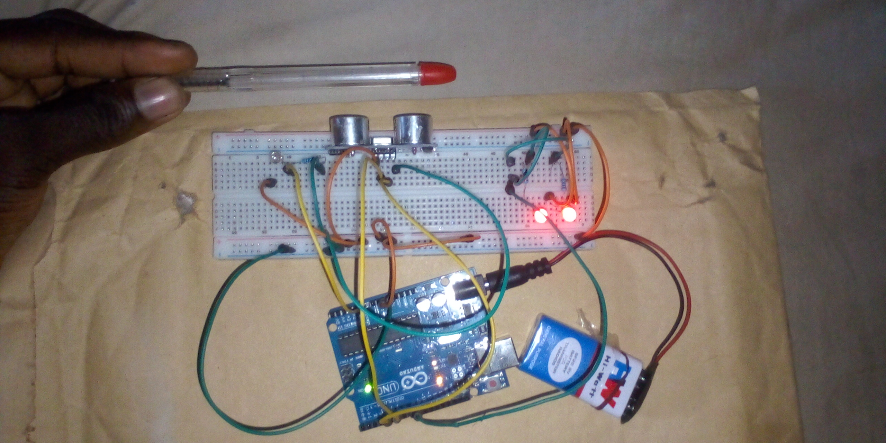

# Environment-Aware Smart LED System – Arduino Project

## Overview
This project demonstrates an environment-aware smart LED control system using Arduino. A potentiometer is used to simulate ambient light levels, while an ultrasonic sensor detects the distance of nearby objects. The LED behavior changes based on both light intensity and object distance, creating a simple smart environment system.

## Objective
- Learn how to read analog sensor values using Arduino
- Control LED brightness using PWM (`analogWrite`)
- Measure distance using an ultrasonic sensor
- Combine multiple sensor inputs to control system behavior
- Monitor system data using the Serial Monitor

## Components Used
- Arduino Uno
- LED
- Potentiometer
- Ultrasonic Sensor (HC-SR04)
- 220Ω resistor
- Breadboard
- Jumper wires
- 9V Battery
- 9V Battery Clip to DC Barrel Jack

## Circuit Diagram

For Other images [Click Here](images/)

## How It Works
1. The potentiometer connected to an analog pin simulates ambient light intensity.
2. The Arduino reads the potentiometer value and converts it into an LED brightness level.
3. The ultrasonic sensor measures the distance of the nearest object using trigger and echo pins.
4. If the ambient light level is low, the LED remains OFF.
5. If the ambient light level is sufficient:
   - When an object is detected within 20 cm, the LED turns ON fully.
   - When no close object is detected, the LED glows dimly using PWM.
6. Sensor readings and system status are displayed on the Serial Monitor.

## Code
The Arduino sketch for this project is located in the [code/ directory](code/street_light_project_on_22nd_october_2025.ino
).

## Demo Video
A demonstration video showing the working project is included in this repository.

📹 **Project Demonstration:**  
[Click here to watch/download the demo video](video/)

*(If the video does not preview directly on GitHub, please download it using the link above.)*

## Reflection (What I Learned)
- Reading and interpreting analog sensor values
- Using ultrasonic sensors for distance measurement
- Combining multiple sensor conditions in one project
- Controlling LED behavior using PWM and logic conditions

## Challenges Faced
- Calibrating brightness thresholds for realistic behavior
- Stabilizing ultrasonic sensor distance readings
- Balancing delays without affecting responsiveness

## Possible Improvements
- Replace potentiometer with a real light sensor (LDR)
- Add a buzzer or alarm for close object detection
- Display sensor readings on an LCD or OLED screen

## Project Status
Completed
